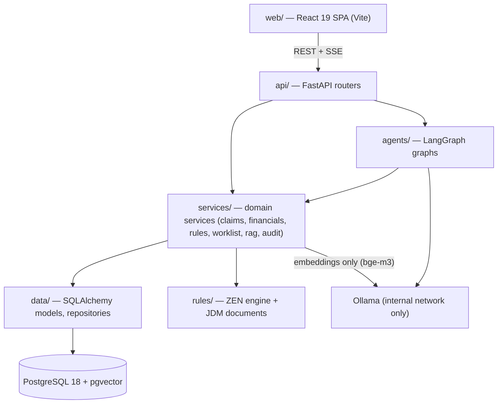
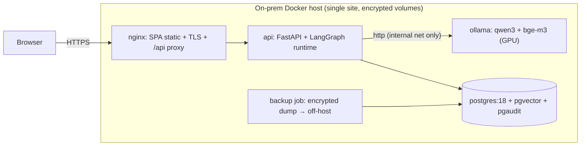

# Architecture Spine — LINEWORKER

## Design Paradigm

**Layered service architecture, API-first.** Four layers with one-way dependencies; the AI agent runtime is a peer consumer of the service layer, never a bypass around it.



Dependency rule: arrows only point downward/rightward as drawn. `web/` knows only the API contract. `agents/` may call `services/` (as LangGraph tools) but never `data/` directly and never the API. Nothing imports upward. Ollama has exactly two clients: `agents/` for chat inference, and `services/rag` for the embeddings endpoint only (`bge-m3`) — query-time embedding of search text happens in `services/rag` before the repository is invoked, so repositories receive vectors, never text.

## Invariants & Rules

### AD-1 — Layered API-first architecture [ADOPTED]

- **Binds:** all
- **Prevents:** business logic re-accreting in the browser (the prototype computes everything client-side in one `<script>`)
- **Rule:** The SPA renders and captures input only. Every calculation, filter-by-permission, and mutation happens behind FastAPI. If a number appears on screen, a service computed it.

### AD-2 — Deterministic core is code, LLM only narrates

- **Binds:** FR-H-3, FR-H-4, FR-DET-3, benefit/reserve/priority/schedule/SLA logic; all copilot answers containing figures; RTW letter merge fields
- **Prevents:** hallucinated dollar amounts; two divergent implementations of the same rule (one in services, one re-derived in a prompt)
- **Rule:** Benefit calculation, priority scoring, reserve check, payment-schedule generation, and SLA aggregation each exist exactly once, in `services/financials` or `services/worklist` (per the ownership map, AD-12). Agents access them only as LangGraph tools; a copilot response may quote tool output but never originate a financial figure. RTW letters merge claim fields from tool output; the LLM drafts only surrounding prose.

### AD-3 — One PostgreSQL owns everything

- **Binds:** all persistent state
- **Prevents:** split-store drift (separate vector DB, separate chat store) and a second backup/security/compliance domain
- **Rule:** Relational entities, pgvector embeddings, LangGraph checkpoints, the AI-insight cache, and the audit log live in the same PostgreSQL instance, migrated by Alembic only. One registered exception: the LangGraph checkpoint tables are created by a dedicated Alembic migration that vendors AsyncPostgresSaver's DDL (pinned to the LangGraph version; upgrading LangGraph requires a new migration) and are written only by the saver inside `agents/` — never by the saver's own `setup()` in prod. Every one of these stores is PHI-class and inherits AD-11.

### AD-4 — Audited command writes, append-only audit

- **Binds:** every mutation (inline edits, review/confirm flags, approve-payment, meeting/note/email creation, agent-initiated writes)
- **Prevents:** unaudited PHI mutation; audit history alterable by the app; per-team audit-record shapes drifting; a retention floor no role can enforce; silent lost updates between concurrent editors
- **Rule:** Writes go through service-layer command functions that emit an audit event in the same transaction, with the fixed schema `(id, at, actor_id, actor_role, action, entity, entity_id, before, after)` — `before`/`after` as JSONB diffs. Mutation commands are optimistic-concurrency guarded per the Write-concurrency convention: PATCH-shaped (edited fields only), taking the caller's `expected_version` and compare-and-swapping on it — no command performs an unguarded read-modify-write; lifecycle/status updates additionally guard on expected current status (the payment batch pays only `payment_scheduled` rows). The application DB role has INSERT-only rights on `audit_event` (no UPDATE/DELETE); retention floor is a deployment config with a 7-year default. One registered exception: a dedicated `audit_redactor` DB role, assumable solely by `services/audit`'s purge and retention jobs, holds exactly two grants on `audit_event` and nothing else — UPDATE on the `before`/`after` columns (the AD-11 redaction path), and DELETE constrained by a row-level-security policy to rows older than the retention floor (end-of-retention housekeeping). Every redaction emits its own audit event (`action: redact`, content-free). No router or agent touches a SQLAlchemy session for writes directly.

### AD-5 — Local-only AI via Ollama [ADOPTED]

- **Binds:** all model inference and embedding
- **Prevents:** PHI leaving the network; accidental cloud fallback (the prototype ships a credential-less `fetch` to api.anthropic.com)
- **Rule:** All inference goes to Ollama on the internal Docker network; the Ollama port is never published. Model names (`qwen3:*`, `bge-m3`) are deployment config, not code. There is no cloud-API code path, including fallbacks.

### AD-6 — One copilot graph: deterministic router + `create_agent` core, middleware-gated claim writes

- **Binds:** FR-CP-1..2, FR-H-9, FR-H-11, quick actions (QAS keys), RTW letter generation
- **Prevents:** ad-hoc per-feature agent loops; hand-rolled tool-calling/interrupt plumbing where the framework now ships it; AI mutating claim records without approval
- **Rule:** Copilot traffic enters one compiled LangGraph StateGraph — a **deterministic supervisor-router** (QAS key→node map, AD-14) whose free-text / LLM tool-calling core is a **`langchain.agents.create_agent`** harness (LangChain v1's supported agent constructor and the successor to the now-deprecated `langgraph.prebuilt.create_react_agent` — the "prebuilt tool-calling architecture" the LangGraph docs steer these loops toward; it compiles to a LangGraph graph embedded as the free-chat node) — checkpointed with AsyncPostgresSaver. **Single gated write step (core invariant):** a claim-entity write executes in **exactly one place** — the gated write-tool step on the copilot graph — reached only after human approval; **no node writes a claim entity except by routing its proposal through that one step.** Free-chat tool calls hit it via `HumanInTheLoopMiddleware` on the `create_agent` core; QAS write nodes (the RTW letter) draft their payload, then hand it to that same core as a **write-tool call** — so every claim write, free-chat or QAS, produces the *identical* `HumanInTheLoopMiddleware` interrupt/resume shape (one wire contract, not two), never a direct command call. The gate is therefore node-agnostic: the write discipline no longer depends on which node originated the write. **Threads:** the key is `(scope, user_id, conversation_seq)` where `scope` is a claim business ID or the literal `dashboard` (`dashboard` is a reserved key shape only — v1 creates claim-scope threads exclusively; dashboard-scope capabilities are Deferred); `claim_id` in state is optional accordingly; the server mints `thread_id`, clients never supply one; "new conversation" increments `conversation_seq` and prior threads become read-only history. A thread is **single-flight**: while a run is active or an interrupt is pending, new messages for that thread are rejected with 409. At most one write may be **pending approval at a time**: the write-tool selection path admits a single write per model step, so an interrupt never batches multiple pending writes and `pending_approval` stays singular; a genuinely required second claim-write is issued only after the first resolves, sequencing as a second interrupt — a per-pending-write serialization, not a hard per-run write quota. **State:** all nodes share one closed typed schema (`messages`, `claim_id`, `pending_approval`, …) — the `create_agent` `state_schema` (an `AgentState` subclass) — declared in a single module (`agents/state.py`); new channels are added there via review, never node-locally. The AD-7 caller context is **not** a state channel: it rides the `create_agent` `context_schema`, re-resolved every run and resume, never checkpointed. **Approval gate:** every `kind: write` tool is gated by **`HumanInTheLoopMiddleware`** on the `create_agent` core (`interrupt_on` the write tools, `allowed_decisions: approve | edit | reject`) — the middleware pauses the run via `interrupt()` **before** any write tool executes, so a write to an AD-12-owned entity (documents, diary, meetings, emails included) reaches its AD-4 command only after explicit user approval; the model may *select* a write tool but can never execute one unapproved (the guarantee is enforced by the per-tool middleware, not by hiding write tools from the model). On `approve`/`edit`, the middleware records an **approval marker** in graph state keyed by the pending tool-call id; the write tool executes only when that marker is present and matches — the single authority. AD-13's registry raise is defence-in-depth against a marker-less call, **not** a second independent approval (an approved write never deadlocks on it). A paused graph resumes only via `Command(resume=…)` from the thread's own `user_id` (others get 403) — no side-channel writes while paused. On `edit`, the human may revise only the write tool's **non-identity arguments** — those that change neither *which* entities are written nor their drafted versions; an `edit` may not add or remove target entities (a collection argument's target set is frozen), and never touches the target entity or the `expected_version`(s) it was drafted against. The gated tool call records the `version` of every entity it was drafted against; on `approve`/`edit`, the write goes through AD-4 commands compare-and-swapped on those versions — a stale approval fails safe (the command 409s, the graph discards the proposal, tells the user the claim changed since drafting, and may re-propose from fresh state; it never force-writes). The same fail-safe covers scope: if the caller context re-resolved on resume no longer contains the drafted entity, the approval is discarded like a stale one. On `reject`, the graph discards the proposal, clears `pending_approval`, and streams an assistant message that the action was cancelled. **All three decisions** (approve/edit/reject) record the outcome (action kind, claim, actor, timestamp — no content) via a `services/audit` `record_copilot_approval` command that emits an AD-4-shaped audit event; that is the only persistence permitted on the reject branch. **Streaming:** the copilot SSE endpoint speaks the stream protocol the assistant-ui LangGraph runtime consumes, per the Copilot stream convention row. Agent-initiated AI-insight refresh is an agent→`services/rag` command (AD-12), not a `kind: write` copilot tool — exempt from both the interrupt gate and the write-tool registry raise, but not from audit.

### AD-7 — Server-authoritative RBAC scoping on every data path

- **Binds:** BR-ROLE-1..2; every endpoint, service call, agent tool, and RAG retrieval
- **Prevents:** the prototype's client-side `HANDLER_MAP` scoping surviving; agent tools or pgvector searches reading claims outside the caller's book of business; supervisors/analysts scoped by a second mechanism or un-scoped by a role bypass
- **Rule:** Every persona — handler, supervisor, analyst — is a row in one `app_user` table (`id, name, role, scope_all`), and scope lives in one table for all roles: `user_employer_assignment (user_id, employer_id)`. Supervisor scope is employer-based, not a handler hierarchy (a handler's book may straddle supervisor scopes — the prototype's Kaya/Deere case is normative). Scope is enforced in the **repository layer**: every repository method (including vector similarity search over claim embeddings) requires a caller context `(user_id, role, employer_ids | ALL)` and applies one unconditional employer filter — `ALL` (derived only from `app_user.scope_all`, resolved in exactly one place, the FastAPI context-builder dependency) makes the predicate a tautology rather than skipping it. **No repository, service, or tool may branch on role to skip or widen the filter**: scope gates visibility; role gates capability (command/router authorization — e.g. supervisor/analyst dashboards are read-only per the BRD) — never the reverse. FastAPI dependencies construct the context; agents receive it as a per-run value on the `create_agent` `context_schema` (never a checkpointed state channel) and pass it to every tool; no code path may query claim data without one. No endpoint accepts a caller-supplied scope. The caller context is a reference (user id + role), never a materialized scope: on every run start **and every resume**, the API dependency re-resolves it from `app_user` + `user_employer_assignment`, so a resumed thread never replays yesterday's book of business; if the re-resolved scope no longer contains a pending write's target entity, that approval fails safe like a stale one (AD-6).

### AD-8 — Two-tier rules: JDM owns parameters, Python owns formulas

- **Binds:** FR-Q-4, FR-DET-3, FR-SUP-2/3; priority weights, reserve bands, SLA targets, worklist caps, handler-benchmark thresholds vs. benefit math
- **Prevents:** the same rule forked between config and code; statutory math becoming un-testable JSON
- **Rule:** ZEN JDM documents (versioned in the DB with effective dates) own **parameters and decision tables** — weights, thresholds, bands, caps. Typed Python owns **formulas** — benefit calculation (comp-rate %, state min/max clamp, waiting period), score arithmetic, schedule construction — and reads its tunables from ZEN. A given rule element exists in exactly one of the two tiers, never both.

### AD-9 — Frontend state discipline

- **Binds:** all of `web/`
- **Prevents:** mixed state idioms across independently built screens; queue, detail, and dashboard showing three states of one claim
- **Rule:** Server state exclusively via TanStack Query, with all query keys declared in one shared `queryKeys` module (keyed by entity + business ID). Optimistic updates are allowed only for user-entered scalar fields; server-derived values (risk, flags, totals, priority) are never computed client-side — mutations invalidate the affected entity keys and wait for the server. A 409 stale-write response rolls back the optimistic value and renders the returned fresh state inline at the edited field — no silent retry, no client-side merge. Local UI state via React state/context only. Copilot chat uses the assistant-ui LangGraph runtime over SSE — no hand-rolled fetch streaming.

### AD-10 — One computer per derived value; AI narratives live in a cache

- **Binds:** `days_open`, `risk`, `siu_review`, `rtw_blocked`, `payment_due`, `total_paid`, `total_incurred`, SLA aggregates; `cp_*` AI narratives (similar-case, reserve note, next actions, fraud indicators); `claim_embedding` rows (embeddings of claim text are derived data)
- **Prevents:** stale-derivation drift; queue and detail disagreeing on the same flag; cached AI text masquerading as claim data
- **Rule:** Every derived field has exactly one computing function (Python or one JDM document), registered in `services/derivations`; consumers call it, never re-derive, and no derived field is a user-writable column. AI-generated narratives are not claim columns: they live in the `ai_insight` cache table `(claim_id, kind, content, model, generated_at)`, owned and refreshed solely by `services/rag`, displayed with their generation timestamp, and never user-editable.

### AD-11 — PHI protection & lifecycle

- **Binds:** all stores and logs; backups; LangGraph checkpoints; embeddings; document/photo binaries
- **Prevents:** PHI leaking into unencrypted volumes, backups, or operational logs; purge/retention decided differently per store; purged claims resurrectable from audit diffs or DB statement logs
- **Rule:** Everything derived from claim data — including chat checkpoints, embeddings, AI-insight cache, audit diffs, and binaries — is PHI-class: encrypted at rest (encrypted volumes; backups encrypted before leaving the host) and in transit (TLS at ingress; TLS to Postgres). Operational logs (structlog) must never contain PHI field values, prompt bodies, or model outputs — only IDs and event names. Deletion/retention is a single purge cascade owned by `services/audit` that covers every PHI-class store — including LangGraph checkpoints, deleted by `thread_id` per claim/user; copilot-checkpoint retention is its own config knob (default 90 days), distinct from the 7-year audit floor. `audit_event` has a distinct purge disposition — **redact-in-place**: the cascade preserves the row skeleton (actor, action, entity, timestamps) and overwrites `before`/`after` with a redaction marker, executed under the `audit_redactor` role registered in AD-4, so action history survives purge but PHI content does not. pgaudit output is a PHI surface too: statement/parameter logging of DML is disabled (pgaudit captures DDL and role/privilege classes only — value-level history is AD-4's job), and the DB log destination lives on the encrypted volume with bounded rotation. No other code deletes PHI.

### AD-12 — Exactly one write-owner per entity

- **Binds:** all entities; the Capability → Architecture Map is the ownership registry
- **Prevents:** two services writing one table (schedule regeneration clobbering payment approvals; timeline dual-writers; unowned embedding refresh)
- **Rule:** Each entity has exactly one owning service whose commands perform all writes to it; any other layer requests the change through that service. In particular: `payment_schedule_week` is owned by `services/financials` (worklist approval calls financials' command); `timeline_event` rows are emitted only by owning-service commands as a side effect of the mutation they record; embeddings and `ai_insight` are owned by `services/rag` — refresh is initiated by `services/rag` (scheduled) or by an agent through the same `services/rag` command (on-demand); there is one refresh command, not two paths. Staleness is tracked, not assumed away: an AD-4 command that mutates an embedded source field calls `services/rag`'s mark-stale command in the same transaction (the request-through-the-owner path, not a second writer); the scheduled refresh re-embeds stale rows first; similar-case retrieval returns `embedded_at`, and the copilot's similar-case answers disclose staleness beyond a configured threshold.

### AD-13 — Agent tool contract: tools are thin, registered, context-injected

- **Binds:** every LangGraph tool in `agents/`; all agent access to services
- **Prevents:** a tool re-implementing service logic and drifting from it; the LLM choosing its own scope or IDs outside the caller's book of business; agent writes bypassing AD-4 audit
- **Rule:** Every tool wraps **exactly one** service command or query — no business logic, no composition of multiple writes inside a tool. All tools live in one registry (`agents/tools/`), each with a typed Pydantic argument schema and a declared `kind: read | write | refresh`. **Every `kind: write` tool is registered on the `create_agent` core but gated by `HumanInTheLoopMiddleware`** (AD-6): the model may *select* it, but the middleware's `interrupt_on` pauses the run before execution and the tool reaches its AD-4 command only when the **approval marker** for its tool-call id is present in graph state (set by an `approve`/`edit` from the thread's own user) — the model can never execute a write unapproved. Defence-in-depth: the registry refuses a write tool whose approval marker is absent — a guard against a marker-less call from a hand-added node, **not** a second approval a valid write must separately satisfy (so an approved write never deadlocks). QAS write nodes hold no write tools of their own; they route proposals into the same single gated step (AD-6). The third kind, **`refresh`**, is the carve-out: a side-effecting `services/rag` command (AI-insight / embeddings, AD-12) registered like any other entry (so nodes still call the registry, never services directly), caller-scoped and audited — but **not** a `write` tool, so it never passes the approval gate and never trips the write-raise. AD-13 binds **every service invocation from `agents/`**, whether made by the agent's tool node or directly inside any router node — nodes call registry entries, never services; a "RAG node" is graph topology, its retrieval call is a registered read tool. The AD-7 caller context is injected by the registry from the run context (the `create_agent` `context_schema`; AD-6/AD-7), never from a checkpointed state channel and never a tool parameter the model can populate. Tool results enter the model context in a fixed envelope `{ok, data, display}`: `data` keeps API conventions (integer cents, ISO dates); `display` carries service-side human-formatted strings for every money/date field, and prompts instruct the model to quote `display` verbatim (the carve-out from the format-in-UI-only rule). Tool failures return structured error results (never silently swallowed, never raw stack traces into the transcript). No tool imports `data/` or holds a DB session.

### AD-14 — Deterministic routing, honest degradation

- **Binds:** the supervisor router; QAS quick-action keys; all copilot failure paths
- **Prevents:** quick actions behaving differently per LLM mood; the prototype's `offlineAnswer` pattern surviving — canned text presented as live AI; an Ollama outage taking claim operations down with it
- **Rule:** QAS quick-action keys route through a static key→node map in the supervisor router **before** any LLM call; only free-text messages go to the `create_agent` core. Each entry in the map declares `requires_llm: bool`: a QAS node may invoke the LLM to narrate its tool results (never to choose tools or originate figures, per AD-2), and the RTW letter **is** a QAS key whose node runs tool-merge → LLM prose → then emits its drafted write as a proposal into the single gated write-tool step (AD-6), never a direct command call. Per-run bounds are enforced with `ModelCallLimitMiddleware` / `ToolCallLimitMiddleware` on the core (complementing the `ai_limit` convention); `ModelFallbackMiddleware` is deliberately unused — AD-5 forbids any cloud fallback path. During Ollama unavailability, `requires_llm: false` actions execute and stream normally; `requires_llm: true` actions and free chat return the `error` stream event with code `ai_unavailable`, with bounded retry (no retry storms, no cloud fallback per AD-5, no pre-authored answers presented as model output). The UI disables exactly the affected inputs, never the whole copilot pane; copilot degradation never blocks non-AI claim operations — the SPA's claim screens have no hard dependency on the agent runtime.

### AD-15 — Story-scoped Playwright E2E gate

- **Binds:** every story in every epic; the story Definition of Done (`sprint-status.yaml` transitions to `review`/`done`); the CI merge gate; everything under `e2e/`; the `deploy/compose.e2e.yaml` profile
- **Prevents:** a story declared done on unit tests alone; each story inventing its own E2E harness (divergent login helpers, seeds, reset semantics, selector styles); specs asserting on non-deterministic live LLM prose; order-dependent or parallel-flaky suites; test traces/screenshots becoming a PHI store; the gate passing vacuously (empty smoke set, unresolvable "touched story", renamed story keys orphaning specs)
- **Rule:** One Playwright (`@playwright/test`) project at repo root (`e2e/`) drives the composed stack through the browser — real API, real DB, never mocked HTTP. **Environment:** the suite runs against a dedicated `deploy/compose.e2e.yaml` profile (nginx, api, postgres, and `model-stub` — a deterministic Ollama-API-compatible container serving scripted chat/embedding responses; no GPU), identical locally and in CI. The stub exists only in this profile, never in dev/prod (AD-5/AD-14 govern those); copilot degradation specs stop the stub and assert the `ai_unavailable` path. **Seed & PHI:** the seed is the dev seed migration's synthetic data only (the nine personas, demo claims); running the suite against any environment containing real claim data is prohibited — Playwright traces/screenshots/videos are therefore non-PHI and may upload as CI artifacts. **Determinism:** the gate runs `workers: 1`, `fullyParallel: false`; a project-dependency setup (not `globalSetup`) resets the DB — drop schema → Alembic migrate → seed — before **every spec file**, under an e2e-profile-only DB owner role (the runtime app role cannot: AD-4's grants forbid it), so specs are order-independent and never read another spec's writes. **Specs:** every story ships `e2e/stories/<story-key>.spec.ts` (the sprint-status story key) tagged `@story:<epic>-<story>` and `@epic:<n>` (grep patterns anchored so `@story:1-3` never matches `1-30`), covering that story's acceptance criteria end to end; exactly one happy-path test per story is tagged `@smoke`. A story may not move to `review` or `done` until its spec passes against the freshly reset stack. Shared plumbing lives only in `e2e/fixtures/`: login-as-persona (drives the real auth path), the DB reset fixture, selector policy — accessible role first, `data-testid` second, never CSS classes. Copilot specs assert **structure, not prose**: stream event sequence, the `HumanInTheLoopMiddleware` approve/edit/reject round-trip against the stub's scripted write-proposal — covering both a free-chat write and the RTW-letter QAS write, which must present one identical interrupt shape — degradation; anything needing a live model carries `@live-ai` and is excluded from the gate. **CI:** every PR declares its story key(s) (branch name or PR label); CI runs those specs plus the `@smoke` set; merge to `main` runs the full `e2e/` suite, plus a lint asserting a bijection between non-backlog story keys in `sprint-status.yaml` and files in `e2e/stories/` (renaming a story renames its spec in the same change). Specs are amended, never deleted: a later story that legitimately changes earlier behavior updates the affected spec in its own PR, so the full suite is the permanent regression floor.

## Consistency Conventions

| Concern | Convention |
| --- | --- |
| Naming | DB: snake_case per the Excel's `Table.Column` mapping (canonical). Python: snake_case. API JSON + TS: camelCase (Pydantic alias generator). React components PascalCase. |
| IDs | Claims keep business ID `WC-nnnn` (unique, exposed); every table also has surrogate `id` (identity int PK). API routes use business IDs for claims, surrogate ids elsewhere. |
| Dates & money | Dates ISO-8601 (`date` for calendar, `timestamptz` UTC for events). Money as integer cents in DB, API, **and across the ZEN boundary** (JDM inputs/outputs are cents); format in the UI only. |
| Errors | RFC 9457 problem+json envelope from FastAPI exception handlers; SPA maps status → toast/inline (no blocking `alert()`, per NFR-3). |
| Write concurrency | Every mutable claim-aggregate entity carries `version int`; reads return it; AD-4 commands CAS on `expected_version` (`WHERE id = ? AND version = ?`, increment on success) and return 409 problem+json carrying the fresh entity on mismatch. Append-only stores (`audit_event`, `timeline_event`, checkpoints) are exempt — never read-modify-written. Copilot approval writes CAS on the versions recorded in `pending_approval` (AD-6). Conflict resolution is always re-read-and-redo by the user or graph; nothing force-writes or merges server-side. |
| Lists & queries | All list endpoints return `{items, nextCursor, total?}` with cursor pagination and `filter[…]`/`sort` query params; one generated OpenAPI client consumes them. |
| Enums & statuses | Enum values snake_case lowercase in DB/API; UI owns display labels. Lifecycle `stage`: `intake\|investigation\|treatment\|settled`. Payment items: approval sets `payment_scheduled`; only the payment batch marks `paid` (resolves the Excel's row-29 vs row-64 conflict). |
| Auth | OIDC-ready session auth (FastAPI dependency); role + persona claims resolved server-side; tokens never carry claim scope. |
| Logging | Structured JSON (structlog), IDs and event names only — PHI ban per AD-11. Audit events are DB rows (AD-4), not log lines. |
| Config & secrets | 12-factor env vars via one pydantic-settings module; secrets in an env file outside VCS (dev) / host secret store (prod); model names, rule versions, SLA targets from config/DB — never hardcoded. |
| Binary storage | All file bytes go through one `BlobStore` protocol (`put/get/delete/url`) in `services/`; backing impl (volume now, MinIO later) is swappable without touching callers. |
| Copilot stream | The SSE endpoint emits the stream-event protocol the assistant-ui LangGraph runtime consumes (`@langchain/langgraph-sdk` wire format — token streaming via its `messages-tuple`-equivalent events; AD-6's `messages`/`updates` are the server-side LangGraph stream modes feeding it). Event set: `messages`, `updates`, `interrupt`, `error`, `done`; every run terminates with exactly one of `interrupt \| error \| done`; an `error` event carries the problem+json body inline (the RFC 9457 convention governs payload shape, not transport). Resume is a POST to the same runs endpoint carrying `command: {resume: {decision: approve|edit|reject, args?}}` (`edit` includes the revised non-identity arguments), returning a new stream for the same thread; the assistant-ui runtime surfaces the raw `HumanInTheLoopMiddleware` interrupt payload and the copilot frontend owns the mapping to this shape (exercised by the AD-15 round-trip test). Inference carries deployment-config `num_predict` and a per-run wall-clock timeout; exceeding either ends the run with `error` code `ai_limit`. |
| Prompts | All system/task prompts live as versioned files in `agents/prompts/` (git is the version history), loaded by key — never inline string literals in node bodies; QAS keys map 1:1 to prompt files where a prompt is needed. |
| Testing & CI | Server: pytest; `services/financials` and derivations carry property-based tests (Hypothesis) against statutory ranges. Agents: unit tests for the QAS key→node routing map and tool registry (write-tool gate raises without the middleware's approval); graph tests against a stub chat model covering the `HumanInTheLoopMiddleware` approve/edit/reject round-trip; one integration test drives the real SSE + assistant-ui stream protocol end to end. Web: Vitest unit tests; browser E2E is Playwright per AD-15 (one spec per story, story done-gate, e2e compose profile with model stub). CI gate: lint + typecheck + unit tests + the PR's declared story spec(s) + `@smoke` on every PR; full `e2e/` suite + sprint-status↔spec bijection lint on merge to `main`; Alembic migrations must run clean against a fresh DB. |
| Operations | Nightly `pg_dump`/WAL archive, encrypted, copied off-host; restore drill documented. Every container exposes a health endpoint; compose healthchecks gate startup order. |

## Stack

| Name | Version |
| --- | --- |
| Python | 3.12 |
| FastAPI | 0.115+ |
| SQLAlchemy / Alembic | 2.0 / 1.18 |
| PostgreSQL / pgvector | 18 / ≥0.8.2 (CVE-2026-3172 fix) |
| langchain (`create_agent` + `langchain.agents.middleware`) | ≥1.3,<1.4 (pin concrete minor at init) — v1 agent harness on LangGraph; `HumanInTheLoopMiddleware` gates write tools (`approve`/`edit`/`reject`; a `respond` decision also exists, unused in v1), write-scoped `ToolCallLimitMiddleware` keeps writes to one pending at a time; successor to the deprecated `langgraph.prebuilt.create_react_agent` |
| LangGraph (Python) | 1.2.x — low-level runtime under `create_agent`: StateGraph (deterministic router), `interrupt()`/`Command`, AsyncPostgresSaver checkpointer, stream modes |
| langchain-ollama | 1.x (json_schema structured output default since 0.3.0) |
| Ollama | current stable server, image digest pinned at deploy; chat `qwen3:14b` (24 GB GPU) or `qwen3:32b` (48 GB); embeddings `bge-m3` |
| GoRules ZEN (`zen-engine` PyPI, MIT) | current release, pinned at project init |
| React / Vite / TypeScript | 19 / 8 / 7.0 |
| shadcn/ui (Radix + Tailwind 4) | vendored |
| TanStack Query / Table | v5 / v8 |
| Recharts | 3.x |
| assistant-ui (`@assistant-ui/react-langgraph`) | 0.14.x (0.13-era HITL interrupt bugs documented — integration-test the approve/edit/reject round-trip on upgrade) |
| Playwright (`@playwright/test`) | 1.62.x (1.62.1 current, 2026-07-30), pinned at project init; Chromium is the gate browser |
| Docker Compose | v2; NVIDIA Container Toolkit for GPU Ollama |

## Structural Seed

### Container & deployment view



Environments: `dev` (Compose, CPU-only small models allowed), `prod` (Compose, GPU, TLS, encrypted volumes, off-host backups). No Kubernetes at this stage. Ollama and Postgres ports are internal-only; nginx is the sole ingress. The payment batch and embedding refresh run as scheduled jobs inside the `api` process (mechanism deferred).

### Core entity ERD (names + relationships; detail owned by migrations)

```mermaid
erDiagram
  EMPLOYER ||--o{ CLAIM : has
  EMPLOYEE ||--o{ CLAIM : subject_of
  APP_USER ||--o{ USER_EMPLOYER_ASSIGNMENT : scoped_by
  EMPLOYER ||--o{ USER_EMPLOYER_ASSIGNMENT : covers
  CLAIM ||--o{ DOCUMENT : files
  CLAIM ||--o{ BILL : bills
  CLAIM ||--o{ EXPENSE : incurs
  CLAIM ||--o{ PAYMENT_SCHEDULE_WEEK : schedules
  CLAIM ||--o{ TIMELINE_EVENT : logs
  CLAIM ||--o{ TREATMENT_PLAN_STEP : follows
  CLAIM ||--o{ ADDITIONAL_INJURY : records
  CLAIM ||--o{ PHOTO : evidences
  CLAIM ||--o{ AI_INSIGHT : cached_narratives
  CLAIM ||--o{ CLAIM_EMBEDDING : vectorized_as
  APP_USER ||--o{ DIARY_NOTE : writes
  APP_USER ||--o{ MEETING : holds
  APP_USER ||--o{ EMAIL_LOG : sends
  CLAIM |o--o{ DIARY_NOTE : tagged_to
  CLAIM |o--o{ MEETING : linked_to
  CLAIM |o--o{ EMAIL_LOG : about
  STATE_RATE_SCHEDULE ||--o{ CLAIM : governs
  PATH_REQUIRED_FORM }o--|| CLAIM : required_for
  EMAIL_TEMPLATE ||--o{ EMAIL_LOG : seeds
  GLOSSARY_TERM }o--o{ CLAIM : ""
  KNOWLEDGE_CHUNK ||--o{ KNOWLEDGE_EMBEDDING : vectorized_as
  AUDIT_EVENT }o--|| APP_USER : by
```



### Source tree

```text
lineworker/
  web/                     # React 19 SPA (Vite)
    src/features/          #   queue/ claim-detail/ dashboard/ copilot/ diary/
    src/components/ui/     #   vendored shadcn/ui
    src/api/               #   generated OpenAPI client + queryKeys module + TanStack Query hooks
  server/
    api/                   # FastAPI routers (thin; auth deps; SSE endpoints)
    services/              #   claims/ financials/ worklist/ derivations/ rag/ audit/ blobstore
    rules/                 #   ZEN wrapper + JDM documents (versioned)
    agents/                #   deterministic router + create_agent core (+ middleware); tools/ registry; prompts (QAS keys)
    data/                  #   SQLAlchemy models, repositories (scope-enforcing), Alembic
  e2e/                     # Playwright project (AD-15)
    fixtures/              #   persona login, DB seed/reset, shared helpers
    stories/               #   one spec per story, named by sprint story key
  deploy/                  # compose.yaml, compose.gpu.yaml, compose.e2e.yaml (model stub), nginx, backup job, env templates
  docs/                    # BRD, Excel spec, this architecture's renderings
```

## Capability → Architecture Map

(Doubles as the AD-12 write-ownership registry: "Lives in" names the owning service for that capability's entities.)

| Capability / Area | Lives in | Governed by |
| --- | --- | --- |
| Queue, filters, priority sort (FR-H-1, FR-Q-*) | `services/worklist` + `web/features/queue` | AD-2, AD-8, AD-10 |
| Stage-adaptive claim detail, inline edits (FR-H-2, FR-DET-*) | `services/claims` + `web/features/claim-detail` | AD-1, AD-4, AD-10, AD-12 |
| Benefit calc, reserve check, payment schedule + batch (FR-H-3/4/7) | `services/financials` (owns `payment_schedule_week`, `bill`, `expense` writes) | AD-2, AD-8, AD-12 |
| Action worklist + approvals (FR-H-5, Excel rows 29/64–66) | `services/worklist` commands → owning services | AD-4, AD-8, AD-12 |
| Body map & injuries (FR-H-6) | `web/features/claim-detail` (SVG port) + `services/claims` | AD-4, AD-10 |
| Clinical & regulatory fields — ICD-10, OSHA recordability, statutory forms by path (FR-H-8, §7.3) | `services/claims` + `path_required_form` reference data | AD-4, conventions (enums) |
| Copilot chat, quick actions, RTW letter (FR-H-9/11, FR-CP-*) | `agents/` + `web/features/copilot` | AD-2, AD-5, AD-6, AD-7, AD-13, AD-14 |
| Similar-case + labor-law RAG, AI-insight cache | `services/rag` (owns embeddings + `ai_insight`; sole embeddings client of Ollama) + `agents/` | AD-3, AD-5, AD-7, AD-10, AD-12, AD-13 |
| Copilot threads & checkpoints | `agents/` via AsyncPostgresSaver (tables owned by the vendored Alembic migration; purge via `services/audit`) | AD-3 (exception), AD-6, AD-11 |
| Diary, meetings, emails, templates (FR-H-10, FR-DIARY-*) | `services/claims` (diary aggregate) | AD-4 |
| Glossary (FR-GLOS-1) | `glossary_term` reference data + `web/` | conventions |
| Supervisor KPIs, charts, drill-through to claim lists (FR-SUP-1..5, A..D) | `services/worklist` aggregates + `web/features/dashboard` | AD-7, AD-9, AD-10 |
| Analyst deep drill-down & export (FR-AN-1..6) | same aggregates, `web/features/dashboard` | AD-7; depth Deferred (epic) |
| Roles & scoping (BR-ROLE-1..2) | `app_user` + `user_employer_assignment` (seeded by migration; admin rides the deferred IdP decision) + `api/` auth deps (sole scope-context builder) + repository scope contexts | AD-7 |
| Audit, PHI lifecycle & purge (NFR-1, §7.3) | `services/audit` + pgaudit | AD-3, AD-4, AD-11 |

## Deferred

- **Identity provider** — OIDC vs local credentials; the auth dependency is the swap point. Decide before first deployment outside dev. User provisioning and assignment administration (who edits `app_user` / `user_employer_assignment`) ride this decision; until then both are seed-migration data — the demo's nine personas, with `scope_all = true` for the full-portfolio supervisor and analyst personas, enumerated employer rows for everyone else.
- **Binary storage backend** — volume vs MinIO behind the fixed `BlobStore` protocol; only the protocol is binding now. Decide when real files replace placeholders.
- **Payment-batch & scheduler mechanism** — batches run inside the `api` process for now; APScheduler vs worker container is open until payment volume demands it. The `payment_scheduled → paid` transition contract is already fixed (conventions).
- **Analyst workspace depth (FR-AN-1..6)** — export and deep segmentation are their own epic; supervisor drill-through ships with the dashboard, built on the same scope-aware aggregates.
- **Email/calendar egress** — prototype "sends" are logs; real SMTP/ICS integration is a later epic with its own compliance review.
- **State statutory coverage & update cadence** — which of the 17+ jurisdictions ship seeded, who owns `state_rate_schedule` refresh, and sourcing of real statutory form PDFs (prototype links NY WCB placeholders, NFR-4).
- **Derived-flag definitions** — the prototype's hash-bucket demo derivations (`siu_review`, `payment_due`) get real business definitions when rules are authored in JDM; AD-10 fixes only where they're computed.
- **Model pinning** — `qwen3` family adopted directionally; re-benchmark on project prompts before pinning exact tags (research provenance: practitioner-blog grade), and validate tool-calling fidelity at the 14b tier during the agent spike.
- **Knowledge-corpus ingestion** — sourcing, chunking, and refresh cadence for `knowledge_chunk` (labor-law RAG) are undecided; `services/rag` ownership and the embedding path are fixed, the pipeline is not.
- **Copilot approval-gate wiring** — the invariants are binding (one node-agnostic gated write step; one identical `HumanInTheLoopMiddleware` interrupt/resume shape for every write; at most one pending write; marker-gated execution with the registry raise as defence-in-depth; all three decisions audited); their *mechanism* is the agent spike's to finalize under the AD-15 round-trip test, not the spine's: the approval-marker channel's exact name/lifecycle (set on approve/edit, cleared on run end or execution) and whether it is `HumanInTheLoopMiddleware`-native or a thin wrapper, the QAS→core write-tool-call handoff, the backend↔assistant-ui decision reverse-mapping, and the precise fail-safe response code for a scope-lost resume.
- **Copilot answer-quality eval** — an offline eval harness (golden Q&A per QAS key, judged runs) is deferred until real prompts exist; the CI-level graph/routing tests above are the binding floor.
- **Dashboard-scope copilot** — all v1 QAS routes and tools are claim-scoped; the copilot panel appears only in claim context, and no `dashboard`-scope thread is created. Supervisor/analyst copilot capabilities (aggregate read tools, dashboard QAS keys, their prompts) are their own epic; the AD-6 thread key already reserves `scope = 'dashboard'` so adding them changes no key shape. Reopen with the analyst-workspace epic.
- **Monitoring/alerting stack** — health endpoints and backup drills are binding (conventions); the observability tool choice (Prometheus/Grafana vs hosted) is not, until operations owns it.
- **Ollama capacity & queueing** — single-user demo assumption: per-run bounds (`num_predict`, wall-clock timeout) are binding, but concurrent-load behavior (parallel chat runs, chat vs. embedding-refresh contention on one GPU) is unaddressed by decision. Revisit before any multi-user rollout.
- **Horizontal scale / K8s / HA Postgres** — out of scope at single-team scale; revisit if adoption exceeds one site.
- **Fraud-score modeling** — prototype ships static `fraudScore`; a real scoring model (and SIU workflow) is a separate initiative; AD-10 keeps the field derivable.
- **E2E browser matrix** — the AD-15 gate runs Chromium only (internal console, standardized browser assumed); widen to WebKit/Firefox in a scheduled run if the user base ever demands it.
