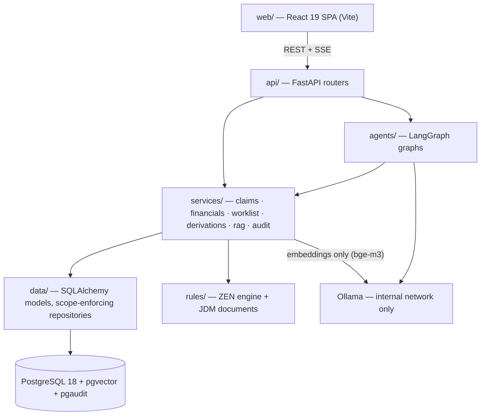
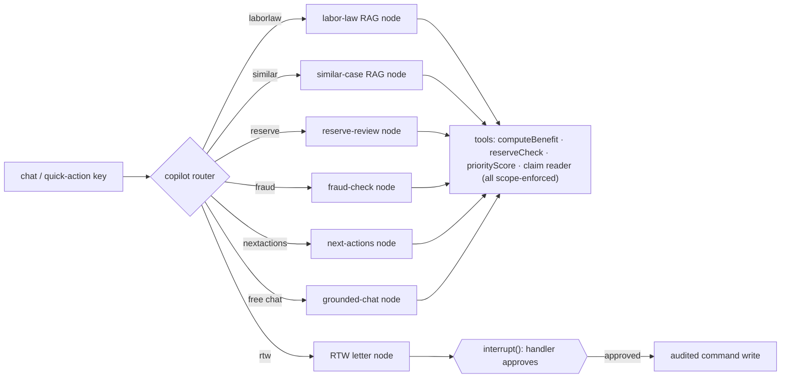
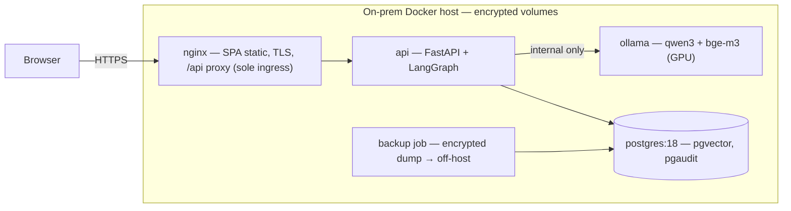

# LINEWORKER — Target-State Architecture
### Rebuilding the Workers' Comp Claims Console as a Production System with Local-Only AI

| | |
|---|---|
| **Product** | LINEWORKER — Manufacturing Workers' Compensation Console (US) |
| **Status** | Final — v1.2, 2026-08-09 (v1.1 agent-hardening pass added AD-13/14; v1.2 gap-review amendments: audit redaction, unified user/scope model, write concurrency, embedding staleness, dashboard-copilot deferral) |
| **Inputs** | `Workers_Comp_Prototype.html` (as-built prototype) · `WC_Feature_Element_Details.xlsx` (field-level spec, 93 rows) · `BRD-Workers-Comp-Console.md` (reverse-engineered BRD) · deep-research run over 21 web sources (verification method: Appendix A) |
| **Hard constraints** | AI inference fully local via **Ollama** (no cloud LLM APIs) · agent layer on **LangChain + LangGraph** |
| **The spine** | `_bmad-output/planning-artifacts/architecture/architecture-lineworker-2026-08-07/ARCHITECTURE-SPINE.md` — the build contract holding decisions AD-1…AD-14, which this document narrates |

---

## 1. Executive summary

The prototype is a single 560 KB HTML file: ~100 synthetic claims hardcoded in a JS array, all business logic computed in the browser, role scoping done client-side, no persistence, and an AI copilot that always falls back to canned answers. Together with the Excel (which maps every UI element to calculation logic and a target `Table.Column`) and the BRD (which enumerates every functional requirement), it amounts to a near-complete *specification* — but none of its code can survive into production as-is.

The target system is a conventional, boring-on-purpose three-tier architecture with one deliberate twist: an **agentic AI sidecar that lives behind the same API boundary as everything else** and can only reach data through the same scoped, audited services.

- **Frontend** — React 19 SPA (Vite), shadcn/ui, TanStack Query/Table, Recharts; copilot chat via assistant-ui's LangGraph runtime.
- **Backend** — FastAPI (Python 3.12), SQLAlchemy 2, service-layer commands with transactional audit events.
- **Data** — one PostgreSQL 18 instance holding relational entities, pgvector embeddings, LangGraph chat checkpoints, the AI-insight cache, and the audit log.
- **AI** — Ollama on the internal network only: `qwen3` for chat/agents, `bge-m3` for embeddings; LangGraph (Python) supervisor graph with human-in-the-loop gates on any AI-initiated claim write.
- **Rules** — GoRules ZEN engine (embedded, MIT) owns business-tunable parameters as versioned JSON; typed, property-tested Python owns statutory formulas.
- **Deployment** — on-prem Docker Compose, single site, GPU-served Ollama, encrypted volumes, off-host encrypted backups.

Fourteen architecture decisions fix the invariants; everything else is intentionally left to the code. Section 10 lists what was deliberately deferred.

### 1.1 The fourteen decisions at a glance

| AD | One-line rule |
|---|---|
| AD-1 | SPA renders only; every computation and mutation happens behind FastAPI |
| AD-2 | Financial/rules logic exists once in Python services; the LLM narrates tool output, never originates figures |
| AD-3 | One PostgreSQL owns relational + vector + checkpoints + cache + audit |
| AD-4 | All writes are version-guarded (CAS) service commands emitting same-transaction, append-only, fixed-schema audit events |
| AD-5 | All inference via internal-network Ollama; model names are config; no cloud path exists |
| AD-6 | One copilot StateGraph; single-flight threads keyed `(scope, user, seq)`; AI writes require `interrupt()` approval and fail safe when stale |
| AD-7 | One `app_user` + `user_employer_assignment` model scopes every role; enforced in the repository layer on every path, including agent tools and vector search — scope gates visibility, role gates capability |
| AD-8 | JDM documents own parameters/decision tables; Python owns formulas; never both |
| AD-9 | TanStack Query with shared queryKeys; optimistic updates for user-entered scalars only; 409 rolls back and renders the conflict inline |
| AD-10 | One registered computer per derived field (embeddings included); AI narratives live in the `ai_insight` cache |
| AD-11 | Everything claim-derived is PHI-class — audit diffs included: encrypted, log-banned, single purge cascade with redact-in-place for audit |
| AD-12 | Every entity has exactly one write-owning service (the spine's Capability → Architecture Map is the registry) |
| AD-13 | Agent tools are thin registry entries wrapping exactly one service call; write tools are never LLM-selectable — they execute only after `interrupt()` approval |
| AD-14 | Quick actions route deterministically before any LLM call; AI outages degrade honestly — no canned answers, and claim operations never depend on the agent runtime |

---

## 2. Why these choices — decision rationale

Each major choice below was checked against current (mid-2026) web sources (verification method in Appendix A). The strongest evidence per decision:

| Decision | Rationale (verified) |
|---|---|
| **LangGraph Python over LangGraph.js** | Both hit 1.0 GA (Oct 2025) with core parity (Postgres checkpointer, `interrupt()`, streaming), but Python gets features first, has ~3× the model integrations (~98 vs ~33) and the far larger community — and keeps agents in the same language as RAG/document tooling. |
| **Ollama + qwen3 for agents** | Qwen3 is the recommended modern local model for tool calling (native tool template; ~75.7 % BFCL v3 at 32B). `langchain-ollama ≥0.3` defaults structured output to Ollama's native `json_schema` API — schema-constrained generation, not prompt-and-pray. |
| **bge-m3 for embeddings** | Won the only verified head-to-head retrieval benchmark: 72 % accuracy vs 59.25 % (mxbai-embed-large) and 57.25 % (nomic-embed-text) on ~6,257 chunks; strongest on long queries (92.5 %) — matching verbose claim narratives and labor-law text. Cost: 1.2 GB. |
| **PostgreSQL + pgvector, no separate vector DB** | pgvector is the verified recommendation under ~10 M vectors — orders of magnitude above this corpus. One database also simplifies compliance (§4.3). Floor ≥ 0.8.2 (HNSW parallel-build CVE-2026-3172 fix). |
| **FastAPI over NestJS/Spring** | Same language as LangGraph; async-native SSE streaming; the verified HIPAA-adjacent reference pattern (FastAPI + Postgres + pgaudit + decorator audit trails + Vault) maps directly onto WC claims data. |
| **GoRules ZEN over Drools** | Rust core with a native Python SDK — embeds in-process, no JVM service; JSON (JDM) rules are git-diffable and visually editable; MIT-licensed; sub-millisecond execution with hot reload vs Drools' JVM footprint. |
| **Vite SPA over Next.js** | Authenticated internal console: no SEO, no public pages; static files behind the existing reverse proxy suit on-prem. The chat layer doesn't constrain this — LangChain's own Agent Chat UI is explicitly Python/TS-agnostic. |
| **assistant-ui for chat** | Ships a dedicated `@assistant-ui/react-langgraph` runtime with token streaming, interrupts, and cancellation — the exact human-in-the-loop primitives AD-6 requires — instead of hand-rolled SSE plumbing or the Vercel-AI-SDK protocol mismatch. |

> **Provenance caveat:** local-model rankings are practitioner-blog grade and move quarterly. The `qwen3` family is adopted directionally; re-benchmark on project prompts before pinning exact tags (Deferred).

---

## 3. System architecture

### 3.1 Layering (AD-1)

Dependencies point one way. The SPA renders and captures input; **if a number appears on screen, a service computed it** — the direct inversion of the prototype, where a single `<script>` owned everything. Agents are consumers of the service layer, never a bypass: they cannot touch SQLAlchemy sessions, cannot call the API, and receive data only through the same scoped tools (AD-13). Ollama has exactly two clients: `agents/` for chat inference, and `services/rag` for embeddings only — repositories receive vectors, never text.

### 3.2 The three logic layers

The prototype's code splits cleanly, and the architecture preserves the split:

1. **Deterministic core (AD-2)** — `computeBenefit` (comp-rate % of AWW clamped to state statutory min/max), `priorityScore`, `reserveCheck` (115 %/60 % adequacy bands), payment-schedule generation, SLA aggregation. Each exists exactly once, in Python, property-tested. The LLM may quote their output; it may never originate a financial figure.
2. **Configurable rules (AD-8)** — the weights, thresholds, bands, and caps inside those calculations (priority weights, reserve bands, SLA targets, the worklist's 7-item cap, handler-benchmark thresholds) are ZEN JDM documents, versioned in the DB with effective dates, editable by business users through the visual editor. A rule element lives in exactly one place — JDM parameters or Python formulas — never both.
3. **AI narration (AD-5/6/10)** — everything the prototype pre-authored as `cp*` fields (similar-case outcomes, reserve commentary, next-best actions, fraud indicators) is generated at runtime by the agent layer and stored in an `ai_insight` cache table with model name and timestamp — clearly provenance-labeled, never user-editable, never confused with claim data.

---

## 4. Data architecture

### 4.1 Entity model

The Excel's `Table.Column` mapping is adopted as the canonical schema (snake_case). Core entities and relationships:

```mermaid
erDiagram
  EMPLOYER ||--o{ CLAIM : has
  EMPLOYEE ||--o{ CLAIM : subject_of
  APP_USER ||--o{ USER_EMPLOYER_ASSIGNMENT : scoped_by
  EMPLOYER ||--o{ USER_EMPLOYER_ASSIGNMENT : covers
  CLAIM ||--o{ DOCUMENT : files
  CLAIM ||--o{ BILL : bills
  CLAIM ||--o{ EXPENSE : incurs
  CLAIM ||--o{ PAYMENT_SCHEDULE_WEEK : schedules
  CLAIM ||--o{ TIMELINE_EVENT : logs
  CLAIM ||--o{ TREATMENT_PLAN_STEP : follows
  CLAIM ||--o{ ADDITIONAL_INJURY : records
  CLAIM ||--o{ PHOTO : evidences
  CLAIM ||--o{ AI_INSIGHT : cached_narratives
  CLAIM ||--o{ CLAIM_EMBEDDING : vectorized_as
  APP_USER ||--o{ DIARY_NOTE : writes
  APP_USER ||--o{ MEETING : holds
  APP_USER ||--o{ EMAIL_LOG : sends
  CLAIM |o--o{ DIARY_NOTE : tagged_to
  CLAIM |o--o{ MEETING : linked_to
  CLAIM |o--o{ EMAIL_LOG : about
  STATE_RATE_SCHEDULE ||--o{ CLAIM : governs
  PATH_REQUIRED_FORM }o--|| CLAIM : required_for
  EMAIL_TEMPLATE ||--o{ EMAIL_LOG : seeds
  KNOWLEDGE_CHUNK ||--o{ KNOWLEDGE_EMBEDDING : vectorized_as
  AUDIT_EVENT }o--|| APP_USER : by
```

Plus reference data: `glossary_term`, and the LangGraph checkpointer's own tables (chat history). The prototype's ~100-claim `ALL_CLAIMS` array becomes the seed dataset via migration.

### 4.2 Key data rules

- **Derived fields are computed, never stored editable (AD-10).** `days_open`, `risk`, `siu_review`, `rtw_blocked`, `payment_due`, `total_paid` — each has exactly one computing function registered in `services/derivations`. The queue chip and the detail badge can never disagree, because they call the same function.
- **One write-owner per entity (AD-12).** The spine's Capability → Architecture Map (feature → owning service) doubles as the ownership registry: `services/financials` owns all payment-schedule writes (worklist "Approve Payment" calls its command); timeline events are emitted only by owning-service commands; embeddings and `ai_insight` belong to `services/rag`. No table has two writers.
- **One user model for every role.** Handlers, supervisors, and analysts are `app_user` rows scoped by the same `user_employer_assignment` table; full-portfolio access is a `scope_all` flag resolved once in the auth dependency — never a role-based filter bypass. Supervisor scope is employer-based, not a handler hierarchy: a handler's book may legitimately straddle supervisor scopes.
- **Concurrent edits can't silently clobber.** Every mutable claim-aggregate entity carries a `version`; commands are PATCH-shaped and compare-and-swap on `expected_version`, returning 409 with the fresh entity on mismatch — the UI rolls back the optimistic value and renders the conflict inline. Lifecycle updates additionally guard on expected current status (the payment batch pays only `payment_scheduled` rows). Append-only stores (audit, timeline, checkpoints) are exempt — never read-modify-written.
- **Money is integer cents** everywhere below the UI — DB, API, and across the ZEN boundary. **Dates are ISO-8601**, event times UTC.
- **Canonical payment transition**: approval sets `payment_scheduled`; only the payment batch marks `paid`. (This resolves an internal contradiction in the Excel, where row 29 has approval marking items `Paid` while rows 64–66 have it setting `Payment Scheduled`.)
- **Write-back semantics from the Excel** (Documents review→confirm, Bills/Expenses approve-payment) become audited service commands. The action worklist and the bills/expenses ledgers stay in sync because they read the same status row — not because two UIs coordinate.

### 4.3 One database (AD-3)

Relational data, vector embeddings, chat checkpoints, AI-insight cache, and audit log share one PostgreSQL 18 instance, migrated by Alembic only. This is a compliance feature, and the rationale lives here: exactly one place PHI can be, one backup stream to encrypt, one encryption boundary, one purge cascade to implement and audit, one surface for pgaudit to watch.

---

## 5. AI & agent architecture

### 5.1 Model serving (AD-5)

| Role | Model | Footprint | Notes |
|---|---|---|---|
| Agent / chat | `qwen3:14b` | ~9 GB, fits 24 GB GPU with headroom | Native tool template; step up to `qwen3:32b` on 48 GB |
| Long-form drafting (optional) | `llama3.3:70b` | 43 GB — dual-GPU/64 GB-Mac only | ~405B-class quality; skip unless hardware exists |
| Embeddings | `bge-m3` | 1.2 GB | 8K context; strongest verified retrieval accuracy |
| CPU-only dev fallback | `qwen3:8b` + `nomic-embed-text` | fits 16 GB unified memory | Verified pairing for constrained hardware |

Ollama runs on the internal Docker network with its port never published; model names are deployment config. **There is no cloud code path** — the prototype's credential-less `fetch` to `api.anthropic.com` has no successor, not even as a fallback.

### 5.2 The copilot graph (AD-6)

One compiled LangGraph `StateGraph` serves all copilot traffic — built on LangGraph's supervisor-router pattern, no relation to the WC Supervisor user role — checkpointed with `AsyncPostgresSaver`. Threads are keyed `(scope, user_id, conversation_seq)`, where `scope` is a claim business ID (`dashboard` is a reserved key shape, unused in v1); `thread_id` is minted server-side, threads are **single-flight** (a new message on a running or interrupt-paused thread gets a 409), and "new conversation" increments the sequence, freezing prior threads as read-only history:

The prototype's seven `QAS` quick-action prompts become the router's named routes — their prompt templates carry over nearly verbatim, versioned as files in `agents/prompts/`. But routing is **deterministic** (AD-14): a static key→node map dispatches quick actions *before* any LLM call; only free-text messages reach the LLM router. Five invariants govern every node:

- **Figures come from tools** (AD-2, §3.2): the reserve-review node calls `reserveCheck` and narrates its output.
- **Tools are thin, registered, context-injected** (AD-13): every tool wraps exactly one service command or query — no business logic, no composed writes — declared `read` or `write` in a single registry with typed schemas. Results enter the model context as `{ok, data, display}`; prompts instruct the model to quote the service-formatted `display` strings for money and dates verbatim. **Write tools are never in any LLM tool-selection set**: the model can only *propose* a write as a `pending_approval` payload; the write tool executes solely after approval, and the registry raises if invoked without the approval token.
- **Scope rides in graph state — and is re-resolved** (AD-7): every tool call carries the caller's scope context, injected by the registry, never a model-suppliable parameter; the similar-case vector search filters by it. On every run start **and every resume**, the auth dependency re-resolves scope from `app_user` + `user_employer_assignment`, so a resumed thread never replays yesterday's book of business. An agent can never narrate another handler's claim.
- **Writes are human-gated and stale-safe** (AD-6): any write to an owned entity must pass `interrupt()` and get explicit approval — assistant-ui renders the interrupt natively, and only the thread's own user may resume. `pending_approval` records the entity versions it was drafted against; approval executes as a version-guarded AD-4 command, so approving a claim that changed since drafting fails safe (re-propose, never force-write). Approve and reject outcomes are both recorded content-free via `record_copilot_approval`. AI-insight cache writes skip the gate but not the audit trail.
- **Degradation is honest** (AD-14): each route declares `requires_llm`. When Ollama is unavailable, deterministic actions keep working; LLM-dependent ones return a typed `ai_unavailable` error with bounded retry — no cloud fallback, and no canned text presented as model output (the prototype's `offlineAnswer` pattern is explicitly banned). The UI disables exactly the affected inputs, and claim screens have no hard dependency on the agent runtime.

### 5.3 RAG design

Two retrieval corpora, both in pgvector, both embedded with `bge-m3` by `services/rag`:

1. **Similar cases** — closed-claim summaries embedded and filtered by injury type / body part / severity band / sector, powering the "Similar case outcomes" card and quick action (exactly what the Excel's row 77 specifies for production).
2. **Labor-law knowledge base** — chunked state WC statutes/rules, powering state-specific briefings with the disclaimer the prototype already carries ("informational only — not legal advice").

Structured outputs (fraud indicator lists, ranked next actions) use `with_structured_output(method="json_schema")` so responses validate against Pydantic models before the UI sees them.

Embeddings are derived data (AD-10): any command that mutates an embedded source field marks the embedding stale in the same transaction (through `services/rag`, the sole embeddings owner and sole embeddings client of Ollama); the scheduled refresh re-embeds stale rows first, and similar-case results carry `embedded_at`, with answers disclosing staleness beyond a configured threshold — retrieval can lag an edit, but never invisibly.

### 5.4 Chat history is PHI (AD-11)

Checkpointed conversations quote diagnoses, wages, and fraud indicators, so they are PHI-class like every other claim-derived store — the full control set lives in §7. The checkpoint tables themselves are created by a dedicated Alembic migration that vendors the saver's DDL (pinned to the LangGraph version — never the saver's own `setup()` in prod), and copilot-checkpoint retention is its own config knob (default 90 days), distinct from the 7-year audit floor.

---

## 6. Frontend architecture

- **React 19 + Vite + TypeScript**, deployed as static files behind nginx. Feature-folder layout mirrors the prototype's screens: `queue/`, `claim-detail/`, `dashboard/`, `copilot/`, `diary/`.
- **shadcn/ui** (vendored Radix + Tailwind 4) for accessible, fully styleable components — the console's dense dark design language ports cleanly.
- **TanStack Query** owns all server state under a single shared `queryKeys` module (AD-9). Optimistic updates apply only to user-entered scalars (an injury description, a severity score); server-derived values (risk tier, flags, totals, priority order) always wait for the server — mutations invalidate and refetch. Every mutation carries the entity's `version`; a 409 stale-write response rolls back the optimistic value and renders the returned fresh state inline at the edited field — no silent retry, no client-side merge. This is what keeps queue, detail pane, and dashboard consistent, where the prototype re-rendered everything from globals.
- **TanStack Table v8** drives the claim queue (priority sort, 8 filters, stage grouping) and the bills/schedule ledgers.
- **Recharts 3** renders KPI donuts and payout stacked bars; every supervisor chart segment drills through to the underlying scoped claim list.
- **The SVG body map ports as-is** — the coordinate dictionary and severity-colored markers become a typed React component.
- **Copilot panel** uses `@assistant-ui/react-langgraph` over SSE: token streaming, `interrupt()` approval UI, and cancellation come from the runtime instead of custom plumbing.
- API access goes through a **generated OpenAPI client** — the backend contract is the single source of TS types (camelCase via Pydantic alias generation).

---

## 7. Security & compliance

WC claims data is HIPAA-adjacent PHI (diagnoses, ICD-10, wages, disability status). The controls, in one table:

| Control | Mechanism | Invariant |
|---|---|---|
| Authorization | Server-authoritative RBAC: every role — handler, supervisor, analyst — is an `app_user` row scoped by `user_employer_assignment`, enforced in the **repository layer**, so every path — REST, aggregate, agent tool, vector search — is scoped. Full-portfolio access is a `scope_all` flag resolved once in the auth dependency; role-conditional filter bypasses are banned — scope gates visibility, role gates capability. No endpoint accepts caller-supplied scope. | AD-7 |
| Authentication | OIDC-ready session auth via FastAPI dependency; roles/personas resolved server-side (IdP choice deferred). | no AD — spine conventions |
| Audit | Every mutation emits a fixed-schema audit event in the same transaction; `audit_event` is INSERT-only for the app role, with one registered exception: an `audit_redactor` role, usable only by `services/audit`'s purge and retention jobs, may redact `before`/`after` diffs and delete rows past the 7-year retention floor. pgaudit adds DB-level capture with DML statement/parameter logging disabled (value history is the audit table's job, not the log's). | AD-4 |
| Encryption | TLS at ingress and to Postgres; encrypted volumes at rest (DB log destination included); backups encrypted before leaving the host. | AD-11 |
| AI containment | Local-only inference; internal-network Ollama; no cloud path; prompts/outputs never logged; agent writes human-gated and version-guarded; write tools never LLM-selectable; outages degrade honestly, never with canned answers. | AD-5/6/13/14/11 |
| PHI lifecycle | All claim-derived stores (checkpoints, embeddings, cache, audit diffs, binaries) are PHI-class; one purge cascade owned by `services/audit` — with **redact-in-place** for `audit_event`: purge preserves the who/what/when skeleton but overwrites the PHI-bearing diffs, so action history survives purge and purged claims are not resurrectable from audit. | AD-11 |
| Data egress | Prototype "emails" are logs; real SMTP/ICS egress is a deferred epic with its own compliance review. | Deferred |

The single-database decision (AD-3, rationale in §4.3) is load-bearing for every row of this table. Local-only AI additionally removes the model-vendor BAA problem entirely.

---

## 8. Deployment & operations

- **Environments**: `dev` (Compose, CPU-only small models permitted) and `prod` (Compose + GPU via NVIDIA Container Toolkit, TLS, encrypted volumes, off-host backups). No Kubernetes until scale demands it.
- **Hardware**: 24 GB-class GPU (e.g. RTX 4090) runs `qwen3:14b` + `bge-m3` comfortably; 48 GB unlocks `qwen3:32b`. VRAM rule: Q4_K_M download size is the floor, KV cache adds ~2–6 GB.
- **Operations conventions**: nightly `pg_dump`/WAL archive, encrypted, copied off-host, with a documented restore drill; every container exposes a health endpoint; compose healthchecks gate startup order. Payment batch and embedding refresh run as scheduled jobs inside the `api` process (worker-container split deferred).
- **CI gate**: lint + typecheck + tests on every merge; migrations must apply clean to a fresh database. `services/financials` carries property-based tests (Hypothesis) against statutory ranges.

---

## 9. Build roadmap

| Phase | Delivers | Keyed to |
|---|---|---|
| **1. Schema & seed** | Alembic migrations from the Excel's table map; prototype's 100 claims imported as seed; scope-enforcing repositories | AD-3, AD-7 |
| **2. Deterministic core** | `financials`, `derivations`, `worklist` services with property tests; ZEN wrapper + first JDM documents (priority weights, reserve bands, SLA targets) | AD-2, AD-8, AD-10 |
| **3. API + SPA shell** | Auth deps, claims/worklist routes, audited commands; queue + stage-adaptive detail + inline edits; supervisor dashboard with drill-through | AD-1, AD-4, AD-9, AD-12 |
| **4. RAG foundation** | bge-m3 embedding pipeline for closed claims + labor-law KB in pgvector, owned by `services/rag` | AD-5, AD-10 |
| **5. Copilot** | Supervisor graph with 7 deterministic quick-action routes, registered scoped tools, Postgres checkpointing, `interrupt()` on RTW letter; assistant-ui panel; honest-degradation paths | AD-2, AD-5, AD-6, AD-7, AD-13, AD-14 |
| **6. Hardening** | Encrypted volumes/backups + restore drill, pgaudit, purge cascade, health checks, CI gate complete | AD-4, AD-11 |
| Later epics | See §10 | Deferred |

---

## 10. Deliberately deferred

Decisions intentionally pushed down, each with the trigger that reopens it:

- **Identity provider** (OIDC vs local credentials) — before the first non-dev deployment. User provisioning and assignment administration ride this decision; until then `app_user` / `user_employer_assignment` are seed-migration data (the demo's nine personas).
- **Binary-store backend** (volume vs MinIO) behind the fixed `BlobStore` protocol — when real files replace placeholders.
- **Payment-batch scheduler mechanism** — when payment volume outgrows in-process jobs.
- **Analyst-workspace depth** (deep drill-down, export) — its own epic on the same scope-aware aggregates.
- **Email/calendar egress** — its own epic with its own compliance review.
- **State statutory coverage, refresh ownership, and real form-PDF sourcing** — before go-live in each jurisdiction.
- **Real business definitions for the demo's hash-bucket flags** (`siu_review`, `payment_due`) — when the JDM rules are authored.
- **Exact model tags** — after re-benchmarking qwen3 against contemporaries on project prompts.
- **Observability tool choice** — when operations ownership is assigned (health endpoints are already binding).
- **Ollama capacity & queueing** — single-user demo assumption; per-run bounds are binding, concurrent-load behavior is not. Revisit before any multi-user rollout.
- **Dashboard-scope copilot** — v1 copilot is claim-context only; supervisor/analyst copilot capabilities are their own epic (the thread key already reserves `scope = 'dashboard'`). Reopen with the analyst-workspace epic.
- **Kubernetes / HA Postgres** — only if adoption exceeds one site.
- **Fraud-score modeling and SIU workflow** — a separate initiative; AD-10 keeps the field derivable.

---

## Appendix A — Traceability

- **BRD** functional requirements (FR-LOGIN/TOP/SLA/GLOS/Q/ACT/DET/CP/DIARY, FR-H-1..11, FR-SUP-1..5 + A..D, FR-AN-1..6, BR-ROLE-1..2) are bound in the spine's frontmatter and mapped to owning components in its Capability → Architecture Map. The BRD's four prototype-limitation NFRs are each discharged: persistence (AD-3), secured server-side AI (AD-5/6), non-blocking notifications (error conventions), statutory-content validation (Deferred, state-data process).
- **Excel** write-back rows (29, 64–66) → audited commands (AD-4) with the canonical payment transition; AI-generated rows (77–80) → `ai_insight` cache (AD-10); rules-engine rows (19–20) → JDM tier (AD-8); every named table appears in the ERD.
- **Research** — the section-2 rationale rests on a deep-research pass over 21 web sources whose extracted claims were each judged by three independent adversarial verifiers (a claim died on two refute votes); 17 claims survived. Full citations in the deep-research output (`tasks/w0qm41dz4.output`) and reviewer reports in `_bmad-output/planning-artifacts/architecture/architecture-lineworker-2026-08-07/reviews/`.
